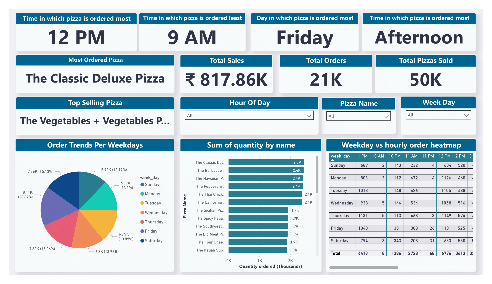

# 🍕 Pizza Sales Analysis Dashboard - Power BI Project

This repository contains a complete Power BI project for analyzing pizza sales using real-world-style CSV data. The goal is to explore order patterns, identify top-performing pizzas, and understand customer behavior across time, pizza types, and order volume.

---

## 📊 Report Highlights

- **Total Sales**: ₹817.86K
- **Total Orders**: 21,000+
- **Total Pizzas Sold**: 50,000+
- **Most Ordered Pizza**: _The Classic Deluxe Pizza_
- **Top Selling Pizza (by Revenue)**: _The Vegetables + Vegetables Pizza_
- **Peak Ordering Time**: Afternoon (especially 12 PM)
- **Lowest Ordering Time**: 9 AM
- **Busiest Day of the Week**: Friday

---

## 📁 Dataset Overview

The project uses four CSV files:

| File Name           | Description                                      |
| ------------------- | ------------------------------------------------ |
| `orders.csv`        | Contains order IDs, order dates, and times       |
| `order_details.csv` | Contains pizza IDs and quantities for each order |
| `pizzas.csv`        | Includes pizza IDs, prices, and categories       |
| `pizza_types.csv`   | Includes pizza names and classifications         |

---

## 🔎 Key Insights

- **Time-based Trends**: Afternoon is the busiest period for orders, with 12 PM being the most active hour.
- **Day-of-Week Trends**: Friday sees the highest volume of orders.
- **Heatmap Analysis**: Hourly order patterns vary by weekday, revealing marketing opportunities.
- **Pizza Performance**:
  - _Most Ordered_: The Classic Deluxe Pizza (highest quantity sold)
  - _Top Revenue_: The Vegetables + Vegetables Pizza (highest sales amount)

---

## 📊 Dashboard Features

- Slicers for filtering by:
  - Pizza Name
  - Weekday
  - Hour of Day
- Visuals:
  - Line charts, bar charts, and heatmaps
  - KPI Cards for total sales, orders, and pizzas sold
  - Interactive filters for drilling down by time and category

---

## 🛠️ Built With

- [Power BI Desktop](https://powerbi.microsoft.com/)
- DAX (Data Analysis Expressions)
- Cleaned and joined data using relationships in Power BI's model view

---

## 📸 Screenshots

## 

## 📌 License

This project is licensed under the [MIT License](./LICENSE).

---

## 🙌 Acknowledgments

This project was inspired and guided by tutorials from the [WsCube Tech YouTube Channel](https://youtube.com/@wscubetech?si=tW0he9z0fLLsz8ew), which provided valuable insights into building Power BI dashboards and working with sales data.
